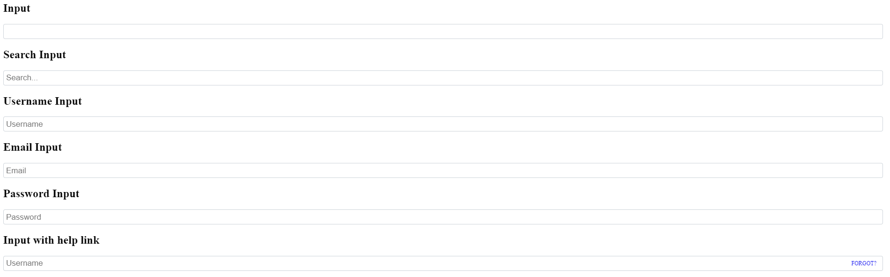

# @scripty/react-buttons

# Description

lightweight react button library.



# Usage
```bash
npm install -s @scripty/react-inputs
```

##### Client: Example.jsx

```javascript
import React, { Fragment } from 'react';
import { Input, UsernameInput } from '@src';
import { PasswordInput } from '@src/PasswordInput';
import { EmailInput } from '@src/EmailInput';
import { SearchInput } from '@src/SearchInput';

export const Example = () => {

    return (
        <Fragment>
            <h2>Input</h2>
            <Input />

            <h2>Search Input</h2>
            <SearchInput />

            <h2>Username Input</h2>
            <UsernameInput />

            <h2>Email Input</h2>
            <EmailInput />

            <h2>Password Input</h2>
            <PasswordInput />

            <h2>Input with help link</h2>
            <UsernameInput
                helpLink={<a tabindex={-1} href={'#'}>FORGOT?</a>}
            />
        </Fragment>
    );
};
```
